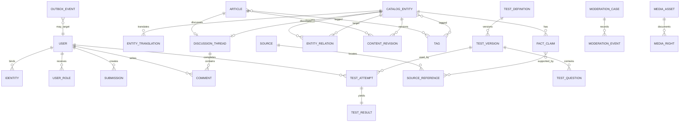

# 数据模型基线

## 原则

- PostgreSQL是交易数据真相源。
- 主键使用不可从数量推断的稳定ID；公开slug可更改但保留重定向历史。
- 核心状态使用受约束枚举或检查约束，不存任意字符串。
- 所有可审核写入包含创建时间、修改时间和执行者。
- 已发布修订不可变；当前版本由指针引用。
- JSONB仅用于形态确实可扩展的快照和配置，不替代稳定关系模型。
- 删除策略显式区分物理删除、软删除、匿名化和隔离。

## 关系概览

图中省略连接表、审计字段和部分多态目标；实现时不应使用无约束的“任意表名 + 任意ID”多态外键。

## 核心表族

### 身份与权限

- `users`
- `identities`
- `sessions`
- `roles`
- `permissions`
- `user_roles`
- `role_permissions`
- `security_events`

外部认证提供方ID只存在于`identities`，业务表只引用`users.id`。

### 资料与来源

- `catalog_entities`
- `entity_translations`
- `entity_aliases`
- `fact_claims`
- `entity_relations`
- `sources`
- `source_references`
- `claim_sources`
- `slug_history`

首版`catalog_entities.kind`仅开放：`character`、`nen_ability`、`organization`、`story_arc`。

### 出版与贡献

- `articles`
- `content_revisions`
- `submissions`
- `review_decisions`
- `publication_events`

`content_revisions.snapshot`可以使用版本化JSONB，但必须通过按内容类型注册的模式校验；数据库记录`schema_version`。

### 分类与搜索

- `categories`
- `tags`
- `tag_aliases`
- `tag_merge_history`
- `content_tags`
- `search_documents`
- `search_query_metrics`

`search_documents`是可重建投影，不是内容真相源。

### 社区与通知

- `discussion_threads`
- `comments`
- `comment_revisions`
- `favorites`
- `notifications`
- `notification_preferences`
- `notification_deliveries`

评论父子关系以数据库约束和应用规则共同限制为两级。

### 测试

- `test_definitions`
- `test_versions`
- `test_questions`
- `test_options`
- `scoring_rules`
- `test_attempts`
- `test_answers`
- `test_results`

已发布`test_versions`及其题目、选项、计分规则不可更新，只能新建版本。

### 治理、媒体与平台

- `moderation_cases`
- `moderation_evidence`
- `moderation_events`
- `sanctions`
- `appeals`
- `media_assets`
- `media_rights`
- `audit_log`
- `outbox_events`
- `job_attempts`

## 并发与幂等

- 可竞争修改使用版本号或更新时间做乐观并发控制。
- 收藏使用`user_id + target_id`唯一约束。
- 提交、审核、邮件发送和外部回调接受幂等键。
- 任务领取使用数据库锁或原子状态变更，避免重复执行。
- 重复事件消费者仍必须幂等，不能假设队列恰好一次投递。

## 索引基线

- 所有外键建立适用索引。
- 发布内容按`status + published_at`建立读取索引。
- 审核队列按`status + priority + submitted_at`建立索引。
- 评论按`thread_id + created_at`分页。
- 名称、别名和规范化搜索字段使用`pg_trgm`的GIN或GiST索引，并用真实查询计划验证。
- 部分索引只覆盖公开、未删除或待处理记录。

索引随访问模式建立，不为每个字段机械加索引。

## 数据保留

| 数据 | 初始策略 |
|---|---|
| 登录会话 | 最长30天，可立即撤销 |
| 未完成测试 | 30天 |
| 原始测试答案 | 90天 |
| 安全审计 | 180天 |
| 原始访问分析 | 90天后聚合 |
| 举报证据 | 结案后180天，争议案件例外 |
| 已删除账号身份数据 | 停用后30天内从主库清除 |

保留任务必须可测试、可观察并记录删除数量；不能只写在隐私政策中。

## 数据迁移

- 使用版本化迁移文件，禁止生产控制台手改结构。
- 采用Expand/Migrate/Contract：先增加兼容结构，再迁移数据，最后删除旧结构。
- 每次迁移同时验证空库和从上一正式版本升级。
- 破坏性迁移前生成恢复点并记录回滚方案。
