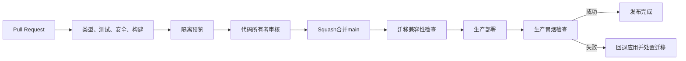

# 部署与环境架构

## 目标部署合同

应用应能够作为标准Node.js服务或Docker镜像运行，依赖：

- PostgreSQL连接串。
- OIDC/认证配置。
- S3兼容对象存储配置。
- 事务邮件端口。
- 可选的搜索、日志和错误报告端口。

业务代码不能假设特定平台请求头、数据库API或专属存储SDK。

## 试运行参考实现

```mermaid
flowchart LR
    Dev["开发者"] --> GH["GitHub"]
    GH --> Checks["GitHub Actions\n检查与安全扫描"]
    GH --> Vercel["Vercel Hobby\nNext.js与预览部署"]
    Vercel --> Supabase["Supabase Free\nPostgreSQL、认证、存储"]
    Vercel --> Mail["事务邮件供应商"]
    Vercel --> Monitor["错误与可用性监控"]
    Backup["独立加密备份"] <-- Supabase
```

GitHub Pages不在目标架构中。它只能承载静态文件，无法提供本项目需要的动态会话、Server Actions、审核和数据库访问。

## 环境

| 环境 | 数据 | 用途 |
|---|---|---|
| local | 本地或隔离开发数据库 | 开发与快速测试 |
| test | 每次测试创建或重置 | 自动化测试 |
| preview | 合成/种子数据 | 每个Pull Request预览 |
| production | 真实用户数据 | 正式试运行 |

Supabase免费额度允许两个项目时，优先分为`dev`和`prod`；预览部署共享隔离的开发项目时必须使用每个预览独立schema或明确重置策略，不允许访问生产数据。

## 配置

应用启动时校验所有必需环境变量，缺失或格式错误立即失败。至少包括：

- 应用基础URL。
- 数据库运行时连接串。
- 数据库迁移连接串。
- 认证密钥和允许的回调地址。
- 对象存储桶、区域和凭据。
- 邮件发件人和API凭据。
- 错误报告环境与版本号。

环境变量必须按`public`、`server-only`、`build-time`分类。只有明确前缀并经过审查的公共值可以进入浏览器包。

## 发布流程



- `main`始终可部署，禁止直接推送。
- 预览环境没有生产秘密。
- 应用部署与数据库迁移使用Expand/Migrate/Contract。
- 新应用必须能与迁移前后的兼容结构短期共存。
- 发布记录关联Git提交、迁移版本和部署ID。

## 免费套餐约束

- Vercel Hobby仅适用于个人、非商业用途；引入广告、付费、商业赞助回报或雇佣开发后需重新评估方案。
- 免费额度可能变化、暂停或没有SLA，不能作为长期业务保证。
- Supabase免费低活动项目可能暂停；必须有外部可用性检查和独立备份。
- 额度接近上限时优先减少资源、缓存公开读取并制定迁移计划，不通过隐藏错误维持表面可用。

## 可迁移路径

从参考部署迁出时：

1. 导出标准PostgreSQL数据和版本化媒体清单。
2. 将认证适配器替换为兼容实现，并迁移用户身份映射。
3. 将S3端口指向新对象存储，按哈希复制并核验文件。
4. 使用Docker镜像部署Next.js和任务执行器。
5. 双读或短期维护期验证后切换DNS。
6. 保留旧环境只读至恢复窗口结束，再清除数据。

迁移演练必须验证用户、权限、内容修订、评论、测试结果、媒体权利和审计链。

## 官方参考

- [GitHub Pages是静态托管](https://docs.github.com/en/pages/getting-started-with-github-pages/what-is-github-pages)
- [Next.js静态导出的服务端限制](https://nextjs.org/docs/app/guides/static-exports)
- [Vercel Git部署](https://vercel.com/docs/git)
- [Vercel默认域名](https://vercel.com/docs/domains/working-with-domains)
- [Vercel Hobby限制](https://vercel.com/docs/plans/hobby)
- [Supabase免费套餐](https://supabase.com/docs/guides/platform/billing-on-supabase)
- [Supabase免费项目暂停](https://supabase.com/docs/guides/platform/free-project-pausing)
