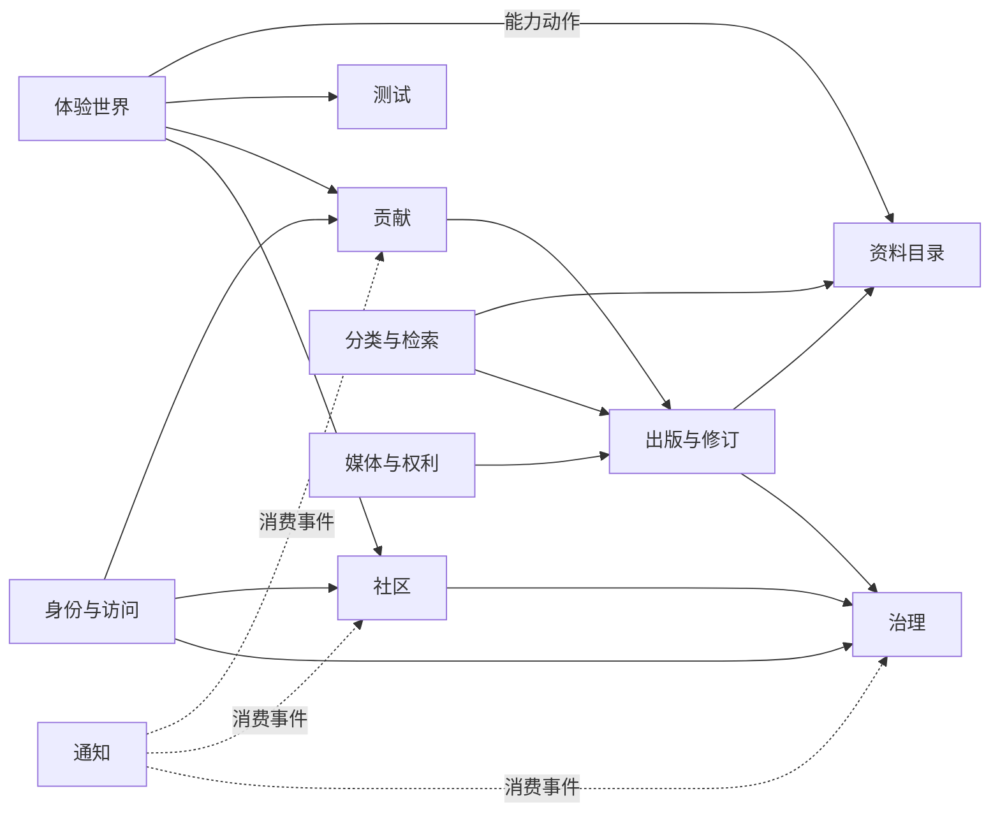
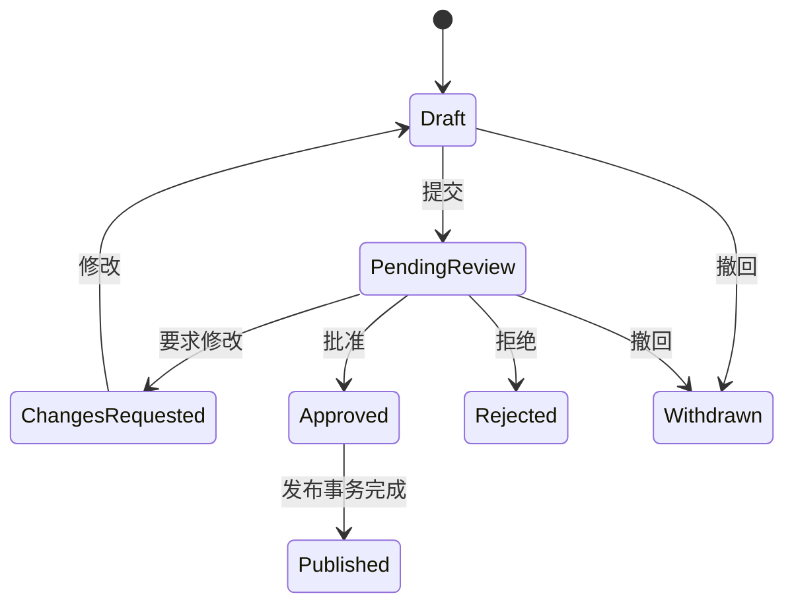
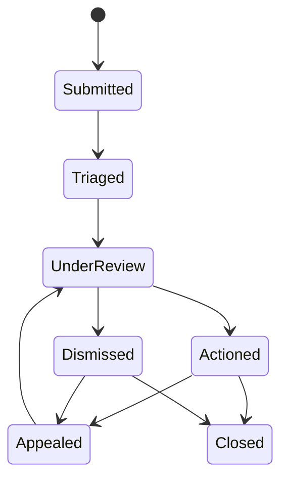

# 领域模型

## 领域划分

箭头表示使用公开能力或共享标识，不表示允许读取对方数据表。

## 核心聚合

### User

负责稳定用户ID、状态和个人偏好。认证凭据属于Identity子域；权限分配通过角色绑定表达。

关键规则：

- 一个用户可绑定多个外部身份。
- 用户名不是主键，可更改且必须保留适当审计。
- 停用用户立即失去新建会话和写权限。
- 高权限角色要求满足二次认证条件。

### CatalogEntity

代表角色、念能力、组织和篇章。实体ID跨语言稳定，名称和简介属于翻译记录。

关键规则：

- 已发布实体必须至少有一个可显示名称。
- 别名可以搜索，但指向同一实体。
- 关键属性应由带来源的事实声明表达。
- 实体关系也必须支持来源、正典状态和剧透等级。

### Article

代表考据、分析、指南和活动等专题内容。

关键规则：

- 当前发布版本是不可变修订的指针。
- 文章可关联多个资料实体和规范标签。
- 发布前必须通过来源、剧透和媒体权利校验。

### Submission

代表用户对文章或资料的新增、修订或纠错请求。

状态机：

批准与发布不得通过两个无关联按钮形成半完成状态。

### DiscussionThread

绑定一个可讨论目标。首版目标仅限已发布资料实体或文章。

关键规则：

- 评论最多两级。
- 软删除父评论保留结构占位。
- 正文使用受限Markdown并保存编辑历史。
- 剧透标记参与显示策略。

### AssessmentDefinition

代表一个版本化测试定义，包含题目、选项、计分规则和解释模板。

关键规则：

- 发布版本不可原地修改。
- Attempt必须固定定义版本。
- 相同版本和答案产生相同结果。
- 原始答案和派生结果按不同保留策略处理。

### ModerationCase

代表一次举报、调查、处置和申诉过程。

关键规则：

- 涉及自己的版主不得处理案件。
- 高风险处罚需要第二名授权人员确认。
- 处罚、内容处置和审计记录分别建模。
- 自动化可排序风险，不可自动永久封禁。

### MediaAsset

代表对象存储中的一个媒体对象及其权利元数据。

关键规则：

- 未通过权利审核的媒体不能公开引用。
- 下架先隔离前台访问，保留案件所需证据。
- 内容与媒体解耦，下架媒体不删除文章结构。

## 来源与正典模型

每项关键事实包含：

- `sourceType`：漫画、1999动画、2011动画、剧场版、官方资料等。
- `sourceRef`：话数、集数、页码或资料定位。
- `canonStatus`：正典、改编补充、冲突、未确认。
- `spoilerLevel`：无剧透、动画进度、漫画进度或更细粒度等级。
- `verifiedAt`：最后核对日期。

来源不是文章末尾的一段自由文本，而是可查询实体；一项事实可以有多个来源支持或冲突。

## 领域事件

首版事件示例：

- `SubmissionSubmitted`
- `SubmissionChangesRequested`
- `ContentPublished`
- `ContentArchived`
- `CommentCreated`
- `CommentReported`
- `ModerationDecisionRecorded`
- `AppealSubmitted`
- `AssessmentCompleted`
- `UserRoleChanged`
- `MediaQuarantined`

事件只描述已经发生的事实，不用命令式名称伪装远程调用。
