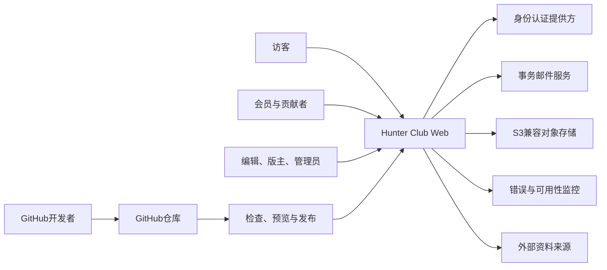
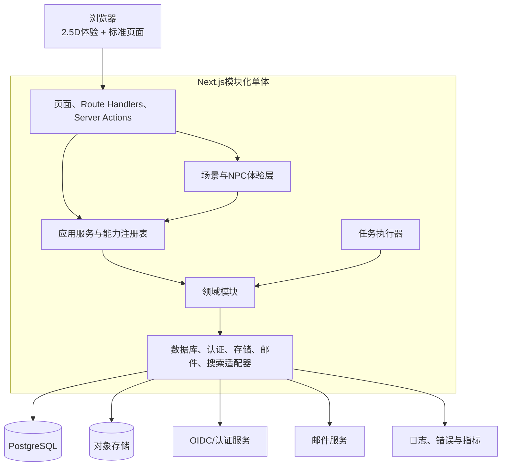
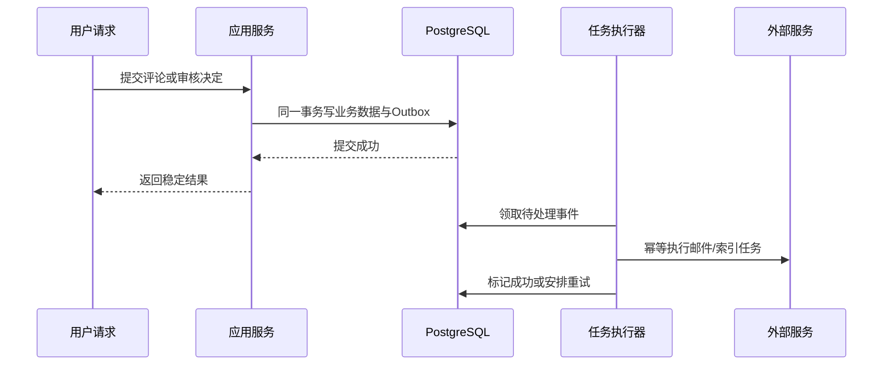

# 系统架构总览

## 架构风格

系统采用模块化单体。用户界面、应用服务和领域模块随同一个Next.js应用部署，但模块通过显式端口协作，各自拥有数据和规则。只有在真实容量、团队或故障隔离需求出现后，才允许将模块拆成独立服务。

## 系统上下文

## 运行容器

## 请求处理原则

### 读取

1. 路由解析用户、语言和剧透上下文。
2. 页面调用所属模块的查询服务。
3. 查询服务应用发布状态、权限和剧透过滤。
4. Server Component直接从应用服务读取，不通过内部HTTP绕行。
5. 返回可缓存的视图模型；浏览器不接收内部实体或敏感字段。

### 写入

1. 表单或Route Handler解析请求。
2. 统一模式校验拒绝格式错误输入。
3. 服务端加载身份并执行授权。
4. 应用服务开启事务并调用领域规则。
5. 业务数据与Outbox事件在同一事务提交。
6. 任务执行器异步处理通知、索引和衍生资源。
7. 返回稳定结果或标准化错误，不暴露底层异常。

## 渲染与缓存

- 公开资料和文章优先服务端渲染，保证直接访问、分享和搜索收录。
- 用户状态、通知和审核页面动态渲染，禁止公共缓存。
- 发布内容以内容版本或缓存标签失效，不以任意短TTL掩盖一致性问题。
- 授权结果、剧透过滤结果和草稿不得进入共享缓存。
- 体验层只在需要动画、浏览器API或本地状态的区域使用Client Component。

## 异步一致性

通知、搜索索引、媒体衍生和分析使用Outbox：

Outbox不用于需要即时强一致的权限和内容发布决定；这些必须在原事务内完成。

## 可迁移性合同

核心业务只能依赖：

- PostgreSQL标准能力和经记录的扩展。
- S3兼容对象存储端口。
- OIDC或认证端口。
- 搜索端口。
- 邮件端口。
- 日志、指标和追踪端口。

Vercel和Supabase是试运行适配器，不得出现在领域模块类型、状态机或业务规则中。
