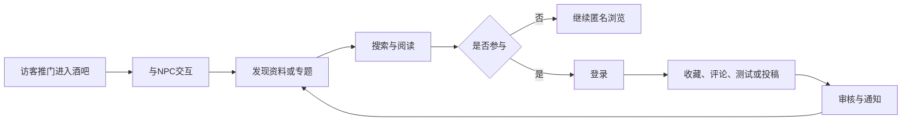

# 产品边界

## 产品定位

Hunter Club是“内容门户 + 受控社区”，不是开放论坛，也不是网页角色扮演游戏。西部酒吧承担品牌识别、探索和导航；资料、文章、测试与讨论承担长期价值。

## 首版价值闭环

## 首版包含

### 叙事体验

- 酒吧门外与酒吧大厅。
- 约4名核心NPC。
- 可配置对话图、功能动作和场景热点。
- 桌面、移动、低性能与减少动态效果模式。
- 直接URL和可访问的标准导航。

### 内容

- 角色、念能力、组织、篇章。
- 专题文章。
- 来源、事实声明、实体关系、别名、标签和翻译结构。
- 漫画、1999动画、2011动画及其他官方资料的来源差异。

### 社区

- 收藏。
- 与内容绑定的两级异步评论。
- 投稿与纠错。
- 审核、版本比较、发布、归档和回退。
- 举报、处罚和申诉。
- 站内通知与必要事务邮件。

### 工具

- 版本化念能力测试。
- 名称、别名、正文和筛选搜索。
- 用户剧透等级。

## 首版不包含

- 自由论坛、用户小组、聊天室和私信。
- 无限层级评论。
- AI自由对话或AI自动修改内容。
- 全3D、自由行走或完整世界地图。
- 任意用户图片上传。
- 个性化推荐、积分商城和复杂成就。
- 多语言内容完整覆盖。
- 商业广告、付费会员或商业化功能。

## 访客与登录边界

访客可以：

- 推门进入酒吧。
- 与公开NPC对话。
- 浏览、搜索公开资料和文章。
- 以本地临时状态完成念能力测试。

登录后才可以：

- 云端保存测试结果。
- 收藏、评论、投稿、纠错和举报。
- 查看个人通知、审核进度和申诉。

## 内容权利边界

- 默认只存储站方原创、用户自有或明确授权的媒体。
- 官方作品主要通过文字描述、来源编号和外部链接引用。
- 仓库不得包含未经授权的扫描页、正片、字幕、音乐或整套官方图片。
- 所有媒体记录权利人、来源、许可依据、审核状态和文件哈希。
- 网站必须显著表明其非官方性质和无隶属关系。

## 成功指标

首版上线后优先验证：

- 访客成功进入酒吧并触发一次NPC交互的比例。
- 从NPC进入资料或专题的比例。
- 搜索零结果率与搜索后点击率。
- 资料阅读完成、收藏、评论和投稿转化。
- 投稿审核耗时和被退回原因。
- 移动端性能、错误率和无障碍阻断问题。

不得用停留时长单独代表成功；场景加载慢也会制造虚假的停留时长。
